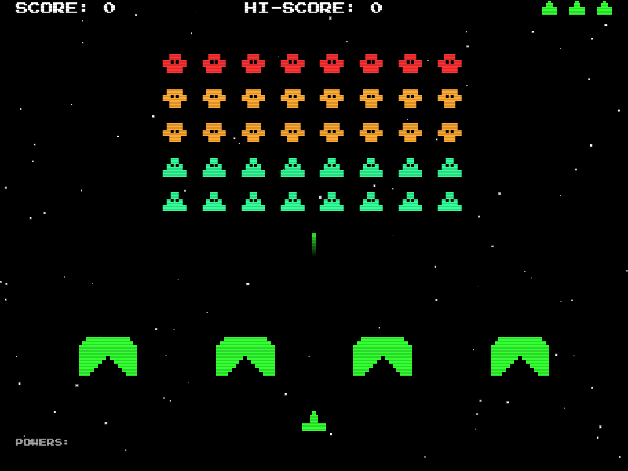

# Space Invaders Clone

A retro arcade Space Invaders clone built from scratch using pure vanilla JavaScript and the HTML5 Canvas API. Zero dependencies, all contained in a single file!

## Features

- **Classic Gameplay**: Navigate your ship and defend against endless waves of invading aliens.
- **Wave Progression**: Clear the board to advance. Aliens start lower, move faster, and shoot more frequently each wave.
- **Dynamic Entities**: Small, medium, and large aliens with varied point values. A mystery glowing UFO occasionally graces the top of the canvas.
- **Pixel Shields**: Take cover behind destructible classic shields that degenerate naturally as they get hit by bullets.
- **Retro Visuals**: Interlaced scanline CRT effects, blocky pixel shapes, smooth interpolating particle explosions, falling bullet trails, and a slow-drifting star field.
- **High Score System**: Your top score is persisted automatically in `localStorage`.

## How to Play

Navigate your ship horizontally and shoot down the aliens before they reach the bottom of the screen. Dodge enemy fire and use the shields strategically.

### Controls

| Action | Key |
|---|---|
| Move Left | `Left Arrow` / `A` |
| Move Right | `Right Arrow` / `D` |
| Fire | `Spacebar` (Hold for auto-fire) |
| Pause / Resume | `P` / `Escape` |

## Tech Stack

- HTML5 Canvas API
- Vanilla JavaScript (ES6)
- CSS3 (scanline gradient overlays)
- Google Fonts (`Press Start 2P`)

## Play Now

[Play the Live Demo!](https://stonedhawk.github.io/space-invaders)
